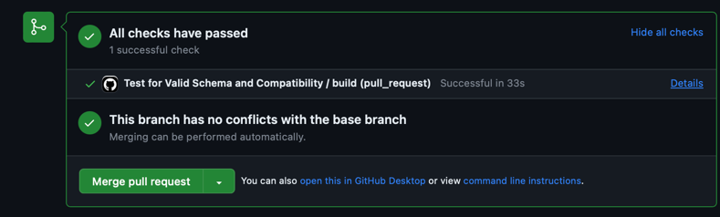
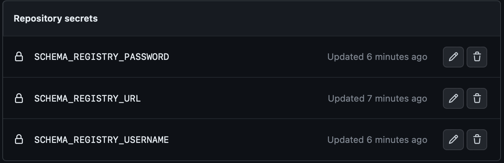

# HealthCo Schema Management Guide

Welcome to the HealthCo Schema Management repository. This repository serves as a central hub for storing and managing
schemas for our cloud infrastructure. The schema management process is divided into two primary workflows: Pull Request
Workflow and Push Workflow.

## Pull Request Workflow

The Pull Request Workflow ensures that schemas are thoroughly validated and compatible before they are merged and
registered. This workflow involves the following steps:

1. **Schema Validation**: Ensure the correctness of the schema and its structure. The schema's subject name and path are
   to be provided for validation.
2. **Local Compatibility Test**: Test the compatibility of the new schema with existing schemas in the local
   environment. Provide details such as the location of existing schemas, the schema to be tested, compatibility level,
   and schema type.
3. **Cloud Compatibility Test**: Verify compatibility with the subject on the cloud. Provide subject name, compatibility
   level, and schema type for testing.

**Note**: Ensure that the specified subject exists; otherwise, the workflow will fail.

The `test-local-compatibility` goal can be utilized to confirm that the schema intended for publication is compatible
with the development environment locally. It's important to note that registration of development schemas on the cloud
is not necessary for this step.

## Push Workflow

The Push Workflow focuses on registering schemas once they have been validated and confirmed to be compatible. The
workflow encompasses the following stages:

1. **Schema Validation**: Ensure the correctness of the schema and its structure. The schema's subject name and path are
   required.
2. **Schema Registration**: Register the validated schema. Provide details such as the subject name, schema path, and
   schema type.

## Adding a Schema

To seamlessly integrate a new schema into the repository, adhere to the following detailed steps:

1. **Place the Schema File**: Initiate the process by locating the schema file and placing it within
   the `src/resources/prod/schemas` directory. This directory acts as the designated storage area for schemas within the
   repository's structure.
2. **Update `latestSchema` Variable**: Navigate to the `pom.xml` file. Update the value of this `latestSchema` variable
   within this file to accurately reflect the changes introduced by the newly added schema.
3. **Create a Pull Request**: A reference to an illustrative pull request can be found
   at [this link](https://github.com/jshahc/HealthCo-Schemas/pull/1)
4. **Compatibility Checks**:  This compatibility validation serves as a crucial quality assurance measure. Verify that
   the compatibility checks associated with the pull request pass successfully.
   

Upon successful merging of the pull request, the newly introduced schema will be automatically registered within the
system.

## Setup

Refer to
the [Schema Registry Maven Plugin documentation](https://docs.confluent.io/platform/current/schema-registry/develop/maven-plugin.html)
for comprehensive details about each goal. The arguments for each goal are defined in the `pom.xml` file.

### Important Reminders

1. Add the following secrets as GitHub actions: `SCHEMA_REGISTRY_URL`, `SCHEMA_REGISTRY_USERNAME`,
   and `SCHEMA_REGISTRY_PASSWORD`. These secrets are vital for the actions to function correctly. You can manage these
   secrets in the GitHub repository settings.
   
2. For the first schema of a subject, direct registration without compatibility checks is necessary since the subject
   does not exist. In such cases, either merge the schema directly into the main branch or register the first schema
   using the UI/API. For more details, refer to
   the [Confluent Cloud Schema Registry Tutorial](https://docs.confluent.io/cloud/current/sr/schema_registry_ccloud_tutorial.html).

## Using the `derive-schema` Plugin

The `derive-schema` plugin offers a convenient method to automatically generate schemas from provided messages. For more
detailed instructions, please consult
the [official documentation](https://docs.confluent.io/platform/current/schema-registry/develop/maven-plugin.html#schema-registry-derive-schema).

Follow these steps to utilize the `derive-schema` plugin effectively:

1. **Prepare Messages**: Begin by compiling a comprehensive list of messages you intend to derive the schema from.
   Organize these messages within a text file.
2. **Set Output Path**: Determine the location where you want the resulting schema data to be saved. This will be the
   path where the generated schema will be stored.
3. **Specify Schema Type**: Indicate the specific schema type that matches your use case. This ensures that the derived
   schema aligns with your intended data format.
4. **Execute the Command**: Open your terminal and enter the following command:

   ```bash
   mvn io.confluent:kafka-schema-registry-maven-plugin:derive-schema
   ```

By adhering to these steps, you can harness the power of the derive-schema plugin to automatically generate schemas
based on your provided message data. This feature streamlines the schema creation process, enhancing your workflow
efficiency.

Thank you for your contributions to HealthCo's schema management. If you have any questions or need assistance, don't
hesitate to reach out to our team. Happy coding!

   
